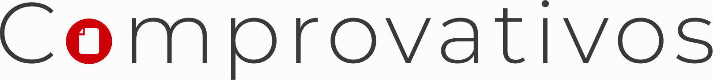

  

<h3 align="center">COMPROVATIVOS</h3>

---

 
    Comprovativos é um serviço de auxilio para as pessoas e comerciantes para verficação de comprovativos de transaçāes bancarias gerados por entidades Angolanas.
      
    Esta solução visa em garantir uma segurança quando recebe um pagamento por transferência bancaria sabendo onde validar se o documento foi alterado ou não.

## 📝 Table of Contents

- [SOBRE](#about)
<!-- - [Getting Started](#getting_started) -->
<!-- - [Deployment](#deployment) -->
- [USABILIDADE](#usage)
<!-- - [Built Using](#built_using) -->
- [TODO](../TODO.md)
<!-- - [Contributing](../CONTRIBUTING.md) -->
- [AUTOR](#authors)
<!-- - [Acknowledgments](#acknowledgement) -->

## 🧐 Sobre 

Somos uma entidade dee auxilio para as pessoas que pretendem ter a certeza se os comprovativos recebidos são verdadeiros ou falsos.
Analizamos os comprovativos bancarios mostrando os possiveis indicios de alteração do documento submetido.

## 🎈 Usabilidade 

Add notes about how to use the system.

## ⛏️ Desenvolvido pelas Tecnologias 

- [Potgres](https://www.postgresql.org/) - Database
- [Express](https://expressjs.com/) - Server Framework
- [React](https://react.dev/) - Web Framework
- [NodeJs](https://nodejs.org/en/) - Server Environment

## ✍️ Authors 

- [@Angleu](https://github.com/Angleu) - Idea & Initial work

<!-- See also the list of [contributors](https://github.com/kylelobo/The-Documentation-Compendium/contributors) who participated in this project. -->
